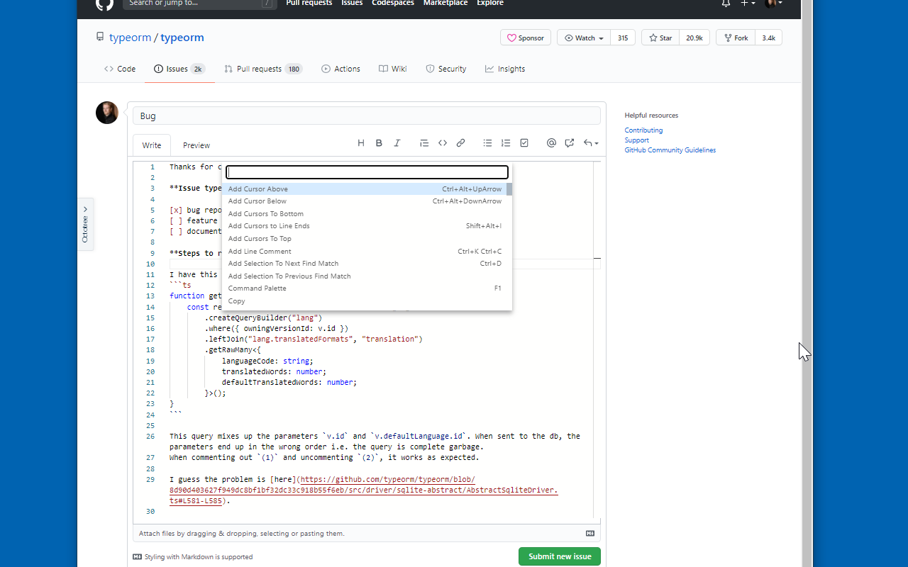
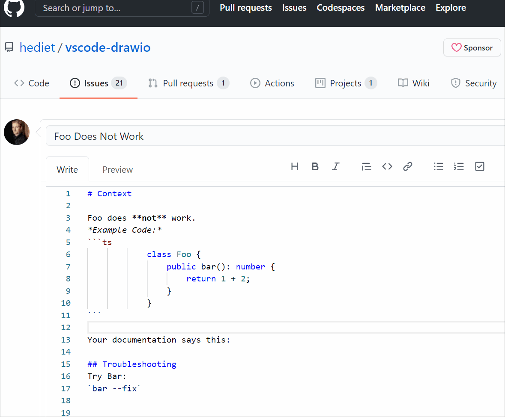
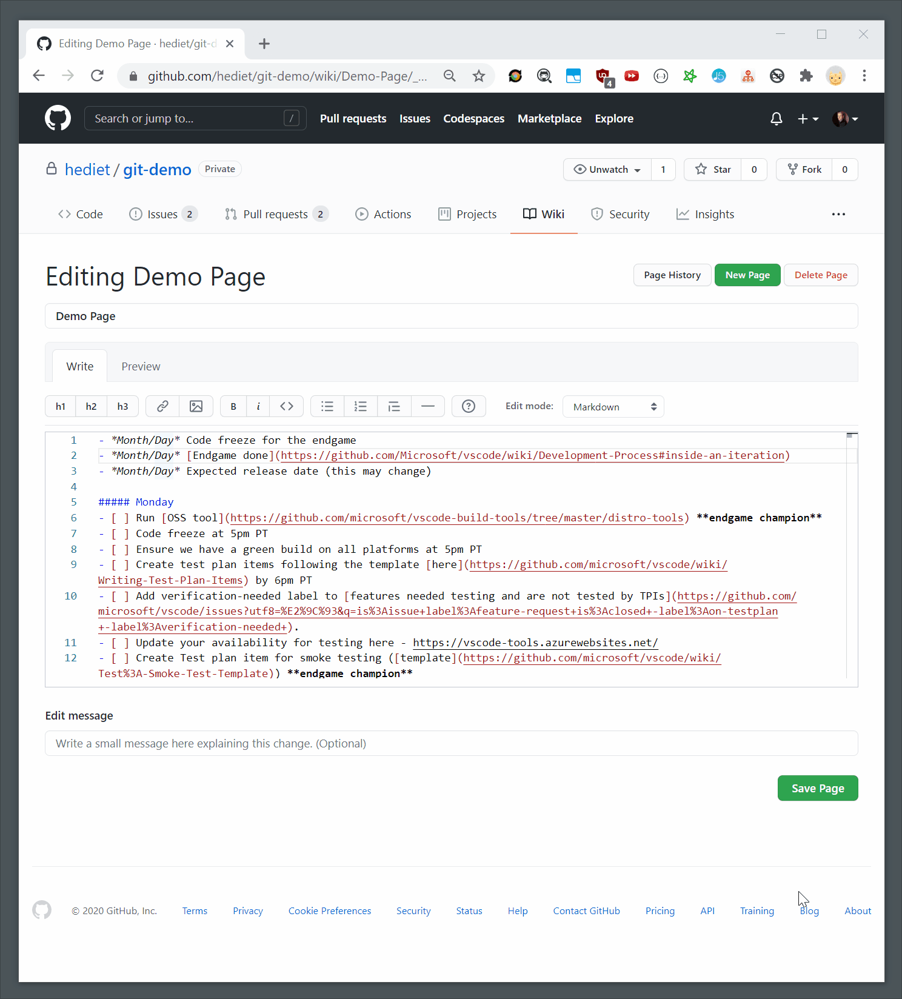

# Monaco Markdown Editor For GitHub (Chrome/Firefox)

[](https://github.com/sponsors/hediet)
[](https://www.paypal.com/cgi-bin/webscr?cmd=_s-xclick&hosted_button_id=ZP5F38L4C88UY&source=url)
[](https://twitter.com/intent/follow?screen_name=hediet_dev)

**[ [Install For Chrome](https://chrome.google.com/webstore/detail/monaco-markdown-editor-fo/mmpbdjdnmhgkpligeniippcgfmkgkpnf) ]** **[ [Install For Firefox](https://addons.mozilla.org/en/firefox/addon/monaco-markdown-github-editor/) ]**

This Chrome/Firefox extension brings the famous Monaco editor to GitHub!



---

## Monaco Features

-   Syntax Highlighting of Markdown and Code Snippets
-   Tab to indent and Shift+Tab to outdent entire selections
-   Multi-Cursor Editing
-   and much more

## Additional Features

-   Press F11 to toggle full screen.
-   The full screen mode previews the markdown if enough space is available.

## Github Features

-   Autocompletion for issues, mentions and emojis.

This extension replaces all GitHub text areas for authoring markdown with a monaco editor.

## Demo



## Full-Screen-Mode



## Building

You need nodejs and yarn. Just run these commands to produce `extension.zip` in the dist folder:

```
yarn
yarn build
```
